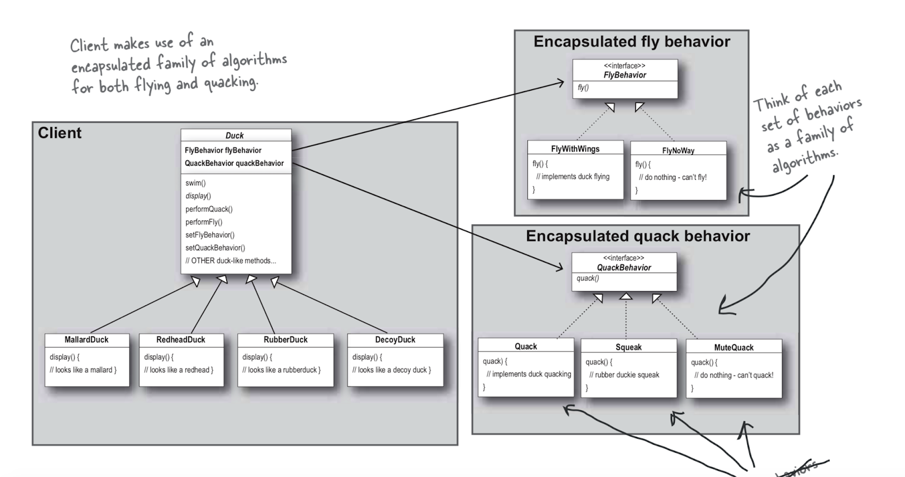

# Chapter 1

## 표준 객체지향 기법

**전략패턴**을 이야기하기 전에 **대표적인 표준 객체지향 기법(상속, 인터페이스)** 만으로 디자인할 경우 어떤 문제가 발생하는지 살펴본다.

### 상속

- 서브클래스에 **코드를 재사용할 수 있다는 장점**이 있지만, **특정 클래스만 행동(method)을 바꿔야하는 경우 오버라이드 해야**한다.
- 오버라이드 해야하는 서브 클래스 양이 많아질수록, 유지보수가 어려워진다.
  - 모든 객체의 행동(method)을 알기 힘들다
  - 상위클래스 코드를 수정했을 때, 원치않는 영향을 끼칠 수 있다.

### 인터페이스

- 인터페이스만을 이용해 특정 행동이 필요한 객체에서 구현을 하는 경우, **특정 서브클래스에 오버라이드해야하는 상황을 피할순 있지만, 코드를 재사용할 수 없게** 된다.

그래서 이를 바뀔만한 부분은 따로 뽑아서 캡슐화하고, 나중에 바뀌지 않는 부분에는 영향을 미치지 않고 그 부분만 고치거나 확장할 수 있도록 만들어야한다.

위 특징을 반영한 패턴이 **전략 패턴** 이다.

---

## 전략 패턴

**객체들이 할 수 있는 행위 각각을 전략클래스로 만들어** 놓고, **동적으로 행위의 수정이 필요한 경우 전략을 바꾸는 것**만으로 **행위의 수정이 가능하도록** 만든 패턴


(출처: https://sajibspeaks.blogspot.com/2019/02/)

<details><summary>객체들이 할 수 있는 행위 각각을 전략클래스로 분리 -> 바뀔 가능성이 있는 부분 분리 (p.46)</summary>

```ts
abstract class Duck {
  private flyBehavior: FlyBehavior;
  private quackBehavior: QuackBehavior;

  //....
}

// 바뀔 가능성이 있는 부분 분리
// fly
export interface FlyBehavior {
  fly(): void;
}

export class FlyWithWings implements FlyBehavior {
  fly(): void {
    console.log("파닥파닥");
  }
}

export class FlyNoWay implements FlyBehavior {
  fly(): void {
    console.log("가만히");
  }
}

// quack
export interface QuackBehavior {
  quack(): void;
}

export class Quack implements QuackBehavior {
  quack(): void {
    console.log("꽥");
  }
}

export class Squack implements QuackBehavior {
  quack(): void {
    console.log("삑삑");
  }
}

export class MuteQuack implements QuackBehavior {
  quack(): void {
    console.log("조용..");
  }
}
```

</details>

<details><summary>행위의 수정이 가능하도록 -> 구현보다는 인터페이스에 맞춰서 프로그래밍 (p.47))</summary>

```ts
abstract class Duck {
  private flyBehavior: FlyBehavior; // 상위 타입
  private quackBehavior: QuackBehavior;

  // ...
}

export class MallardDuck extends Duck {
  constructor() {
    super({
      flyBehavior: new FlyWithWings(), // 하위 타입 클래스로 생성
      quackBehavior: new Quack(),
    });
  }

  display(): void {
    console.log("물오리 모습");
  }
}
```

</details>

<details><summary>동적으로 행위의 수정이 필요한 경우 전략을 바꾸는 것 -> 동적으로 행동 지정하기 (p.56)</summary>

```ts
abstract class Duck {
  private flyBehavior: FlyBehavior;
  private quackBehavior: QuackBehavior;

  setFlyBehavior(newFlyBehavior: FlyBehavior): void {
    this.flyBehavior = newFlyBehavior;
  }

  setQuackBehavior(newFlyBehavior: FlyBehavior): void {
    this.flyBehavior = newFlyBehavior;
  }

  //...
}

const rubberDuck = new RubberDuck();

rubberDuck.setFlyBehavior(new FlyWithWings()); // 동적으로 전략을 변경
```

</details>

---

## 전략패턴에서 디자인패턴 대표 원칙 살펴보기

1. 바뀔만한 부분을 전략클래스로 분리하였다 -> **시스템의 일부분을 다른 부분과 독립적으로 변화할 수 있는 방법을 제공**

2. 행위의 수정이 필요한 경우 전략을 바꾸는 것-> **구현보다는 인터페이스에 맞춰서 프로그래밍 한다.**

3. 슈퍼클래스에서 행동을 상속받는 대신, 행동 객체를 만들어 구상클래스에 구성하였다. -> **상속보다는 구성(composition)을 사용한다.**

---

## 결론

전략 패턴이란, 객체들이 할 수 있는 행위 각각을 전략클래스로 만들어 놓고, 동적으로 행위의 수정이 필요한 경우 전략을 바꾸는 것만으로 행위의 수정이 가능하도록 만든 패턴

### 대표적인 디자인 원칙

1. 시스템의 일부분을 다른 부분과 독립적으로 변화할 수 있는 방법을 제공한다.
2. 구현보다는 인터페이스에 맞춰서 프로그래밍 한다.
   - 핵심은 실행 시에 쓰이는 객체가 코드에 고정되지 않도록 상위 형식에 맞춰 프로그래밍해서 다형성을 활용해야 한다.
3. 상속보다는 구성(composition)을 사용한다.
