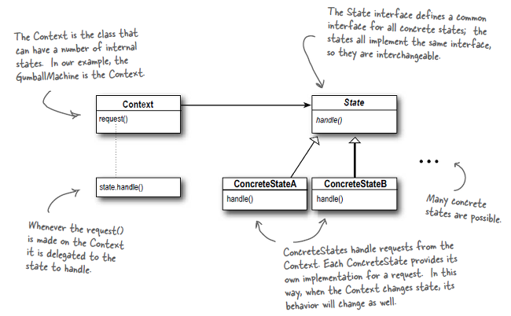

# 상태 패턴

객체의 다양한 **상태를 클래스로 선언**하여 객체가 **상태에 따라 다른 행동**을 할 수 있게 만드는 패턴



상태를 별도의 클래스(`ConcreteStateX`)로 캡슐화한 다음 현재상태를 나타내는 객체에게 행동을 위임(`state.handle`)하는 형태

---

## Why

객체 상태에 따라 행위가 바뀌어야하는 경우, 분기처리가 늘어 날 수 있다.

ex) 각 상태에 따라 process 방식과 display 방식이 달라지는 App 클래스(`Context`)

```ts
type State = "init" | "loading" | "success" | "fail";

export default class App {
  #state: State;

  constructor() {
    this.#state = "init";
  }

  // 상태에 따라 행위에 분기문이 추가 된다.
  process() {
    if (this.#state === "init") {
      console.log("초기화중");

      this.#state = "loading";
    } else if (this.#state === "loading") {
      console.log("데이터 로딩중");

      if(...){
          this.#state = "success";
      } else(...){
          this.#state = "fail";
      }

    } else if (this.#state === "success") {
      // noop
    } else if (this.#state === "fail") {
      // noop
    }
  }

  showDisplay() {
    if (this.#state === "init") {
      console.log("초기화 화면 보여주기");
    } else if (this.#state === "loading") {
      console.log("데이터 로딩중 화면 보여주기");
    } else if (this.#state === "success") {
      console.log("로딩 성공 화면 보여주기");
    } else if (this.#state === "fail") {
      console.log("로딩 실패 화면 보여주기");
    }
  }
}
```

여기서 새로운 상태가 추가될 때 마다, 분기문이 하나씩 늘어나 확장이 어려워진다.

그래서 객체 상태를 클래스로 분리하여, 각 상태 클래스에서 자기가 할 일을 구현하도록 만들면 상태별 코드 관리가 비교적 용이해진다.

---

## 상태 패턴 예

- App(Context)

  ```ts
  export default class App {
    // 구성(composition)
    // 모든 상태 객체를 선언
    #initState: InitState;
    #loadingState: LoadingState;
    #successState: SuccessState;
    #failState: FailState;

    #state: State;

    constructor() {
      this.#initState = new InitState(this);
      this.#loadingState = new LoadingState(this);
      this.#successState = new SuccessState(this);
      this.#failState = new FailState(this);

      this.#state = this.#initState;
    }

    process() {
      this.#state.process(); // 행위는 상태객체에게 위임한다. Context(App)의 상태 객체를 바꾸는 것만으로 객체의 행위가 변경되기 때문에 분기문이 사라졌다.
    }

    showDisplay() {
      this.#state.showDisplay();
    }

    setState(state: State) {
      this.#state = state;
    }

    // getters...
  }
  ```

- State

  ```ts
  /**
  * 상태 종류
  1. init 초기화
  2. loading 로딩
  3. success 성공
  4. fail 실패
  */
  export interface State {
    process(): void;
    showDisplay(): void;
  }

  // 각 상태별로 행위를 구현한다.
  export class InitState implements State {
    #app: App;

    constructor(app: App) {
      this.#app = app;
    }
    process(): void {
      console.log("초기화중..");

      this.#app.setState(this.#app.getLoadingState());
    }
    showDisplay(): void {
      console.log("초기화 화면 보여주기");
    }
  }

  export class LoadingState implements State {
    #app: App;

    constructor(app: App) {
      this.#app = app;
    }
    process(): void {
      console.log("로딩중..");
      if(...){
       this.#app.setState(this.#app.getSuccessState());
      } else {
        this.#app.setState(this.#app.getFailState());
      }
    }
    showDisplay(): void {
      console.log("데이터 로딩중 화면 보여주기");
    }
  }

  export class SuccessState implements State {
    #app: App;

    constructor(app: App) {
      this.#app = app;
    }
    process(): void {
      // noop
    }
    showDisplay(): void {
      console.log("로딩 성공 화면 보여주기");
    }
  }

  export class FailState implements State {
    #app: App;

    constructor(app: App) {
      this.#app = app;
    }
    process(): void {
      // noop
    }
    showDisplay(): void {
      console.log("로딩 실패 화면 보여주기");
    }
  }
  ```

새로운 상태가 추가된다면, 여기서 새로운 상태클래스를 정의하여 사용한다.

---

## 결론

- 상태의 일련의 행동을 캡술화하여 상태 클래스로 만들어 자연스럽게 Context 객체에서도 상태에 따라 행위가 바뀌는 것이 특징

- 상태별 코드 관리가 비교적 용이해지지만, 상태가 늘어날수록 클래스 수도 함께 늘어난다.

## 상태 패턴 vs 전략 패턴

두 패턴 모두 구성(composition)과 위임으로 각각 다른 코드를 실행시키는 형태

- 전략패턴

  - `행위`를 클래스로 분리한다.
  - `상속` 받는 대신 `행위 객체`들을 구성(composition)한다. (상속이 제거된다)
  - `클라이언트`에서 필요한 다음 `전략(행위)`을 변경

- 상태패턴
  - `상태`를 클래스로 분리한다.
  - `조건문`으로 분기하는 대신 `상태 객체`들을 구성(composition)한다. (상태별 분기문이 제거된다)
  - `전환 규칙`에 의해 `상태`를 변경
