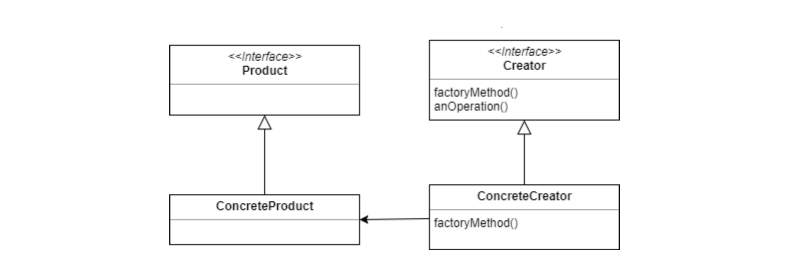
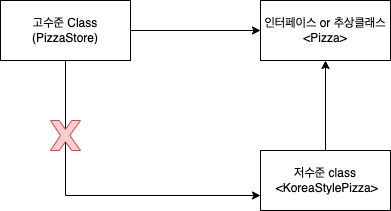
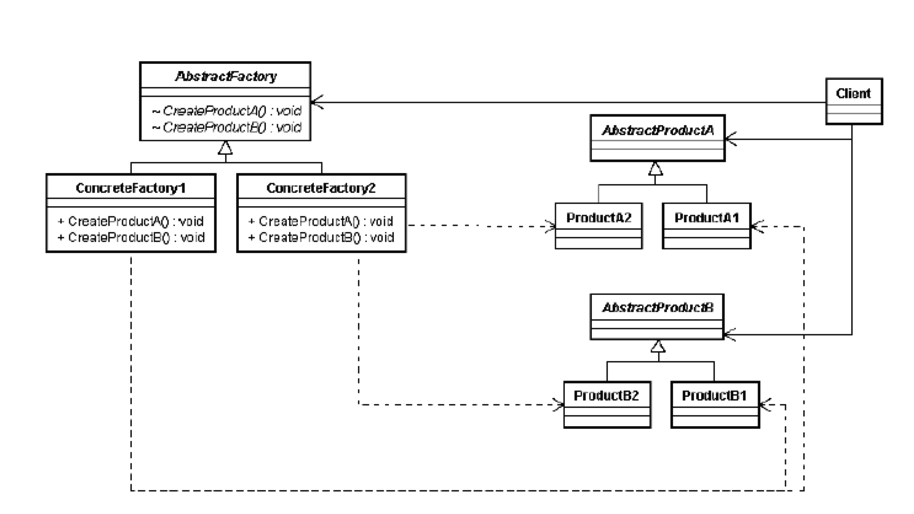

# 팩토리 패턴

구상클래스 객체를 만드는 부분을 팩토리로 분리하는 패턴.

구상 클래스(new)를 많이 사용하면 새로운 구상 클래스가 추가될 때마다 코드를 고쳐야한다.

```ts
let duck: Duck;
if (picnic) {
  duck = new MallarDuck();
} else if (hunting) {
  duck = new DecoyDuck();
} else if (inBathTub) {
  duck = new RubberDuck();
}
```

새로운 클래스를 추가하거나 제거할 때마다 매번 확인해야한다. 관리와 갱신이 어려워진다.

## 1. 간단한 팩토리

```ts
class PizzaStore {
  private simplePizzaFactory: SimplePizzaFactory;

  constructor(simplePizzaFactory: SimplePizzaFactory) {
    this.simplePizzaFactory = simplePizzaFactory;
  }

  // client
  orderPizza(type: string) {
    const pizza = this.simplePizzaFactory.createPizza(type); // 객체 생성 부분(변경이 많은 부분)을 팩토리로 분리

    // Pizza 인터페이스에 맞춰 구현되어있기 때문에 pizza가 변경되어도 호출이 가능하다.
    pizza.prepare();
    pizza.bake();
    pizza.cut();
    pizza.box();

    return pizza;
  }
}

// 팩토리
class SimplePizzaFactory {
  public createPizza(type: string) {
    if (type === "cheese") return new CheesePizza();
    if (type === "pepperoni") return new PepperoniPizza();
    if (type === "clam") return new ClamPizza();
    if (type === "veggie") return new VeggiePizza();
  }
}

// 다형성을 활용하기 위해 추상클래스 사용
abstract class Pizza {
  prepare(): void;
  bake(): void;
  cut(): void;
  box(): void;
}

class CheesePizza extends Pizza {
  //...
}
```

팩토리는 생성부분을 다른 개체로 옮기기만 한 것이라 생각 할 수 있는데, 피자를 사용하는 여러 클래스에서 이 팩토리를 사용하게 된다면, 생성부분에 변경이 일어났을 때 팩토리 하나만 수정하면 된다.

---

## 2. 팩토리 메서드 패턴

**객체 생성에 필요한 인터페이스를 만들고 생성을 서브클래스에게 맡기는 형태의 패턴**을 팩토리 메서드 패턴이라 부른다.



```ts
abstract class PizzaStore {
  orderPizza(type: string) {
    const pizza = this.createPizza(type); // 추상메서드를 호출한다. 슈퍼클래스의 orderPizza()는 서브 클래스에서 무슨 일이 일어나는지 알지 못한다.

    pizza.prepare();
    pizza.bake();
    pizza.cut();
    pizza.box();

    return pizza;
  }

  // 팩토리 메서드
  abstract createPizza(type: string): Pizza;
}

// 서브 클래스
class KoreanStylePizzaStore extends PizzaStore {
  // 서브클래스의 createPizza에서 어떤 피자를 만들지 전적으로 결정한다.
  createPizza(type: string) {
    if (type === "cheese") return new KoreanCheesePizza();
    if (type === "pepperoni") return new KoreanPepperoniPizza();
    if (type === "clam") return new KoreanClamPizza();
    if (type === "veggie") return new KoreanVeggiePizza();
  }
}

class AmericanStylePizzaStore extends PizzaStore {
  createPizza(type: string) {
    //...
  }
}
```

팩토리 메서드(createPizza)는 객체생성을 서브클래스에 캡슐화할 수 있다. 이 방식은 **슈퍼클래스의 클라이언트 코드와 서브클래스**의 **객체 생성 코드를 분리**할 수 있다.

최종 정리하면, **추상클래스 Creator(PizzaStore)가 팩토리메서드용 인터페이스를 제공**하고, **서브클래스 ConcreteCreator(KoreanStylePizzaStore)가 팩토리 메서드를 구현해 객체 인스턴스를 만든다.**

---

## 3. 의존성 뒤집기 원칙

팩토리패턴에 반영된 디자인 원칙 중 **의존성 뒤집기 원칙**이 있다.

**추상화된 것에 의존하게 만들고, 구상 클래스에 의존하지 않는다.**

이 원칙은 고수준이 저수준 구성요소에 의존하면 안되며, 항상 추상화에 의존하게 만들어야한다는 뜻이 담겼다.



- 팩토리를 사용하지 않는다면
  - 고수준 클래스 -> 모든 종류의 저수준 객체
- 팩토리를 사용한다면
  - 고수준 클래스 -> 인터페이스 or 추상클래스 <- 모든 종류의 저수준 객체

의존성 방향이 한방향으로 흘러가다, 반대로 뒤집어지는 모양이 그려진다.

### 2-1. DI 가이드라인

- 변수에 구상 클래스 레퍼런스 저장 X (팩토리 사용한 부분)
- 구상 클래스에서 유도된 클래스가 아닌, 인터페이스나 추상 클래스처럼 추상화된 것으로 부터 클래스를 만든다.
  - \*[유도된 클래스](https://makecodework.tistory.com/entry/Java-%EA%B0%9D%EC%B2%B4%EC%A7%80%ED%96%A5-%EC%83%81%EC%86%8D): 상속받는 클래스
- 베이스 클래스의 구현된 메서드를 오버라이드 하지 않는다. -> 모든 서브 클래스에서 공유할 수 있는 것들로만 정의한 부분인데 오버라이드는 추상화를 저해한다.

모든 경우를 지키긴 어렵지만, 시스템 디자인 원칙에서 지키지 않은 원칙도 명확히 알아야 예외상황도 명확히 둘 수 있다.(개인적으로 좋은 말 같다.)

**팩토리 패턴**이 **구상 클래스들의 의존성을 줄이기 위한 DI 방법 중 하나**라는 걸 알 수 있다.

---

## 3. 추상 팩토리 패턴

서로 연관되거나 의존적인 객체(ingredient)로 이루어진 제품군(koreanStyle, americanStyle)을 형성해야할 때, 해당 제품군 생성하기위한 인터페이스(IngredientFactory)를 제공하는 패턴



먼저 추상 팩토리 안썼을 경우 살펴보면

```ts
export class KoreanPeperoniPizza extends Pizza {
  constructor(indegredientFactory: IndegredientFactory) {
    super({ name: "한국식 페페로니 피자", indegredientFactory });

    // 아래 연관되는 재료들이 그대로 멤버변수에 할당됨
    // 다시 이 부분을 팩토리로 뺄 여지가 있다.
    // 이 연관된 재료들을 모아 제품군을 형성하는 팩토리를 만드는 패턴
    this.dough = new ThinDouth();
    this.cheese = new ChedaCheese();
    this.sauce = new TomatoSauce();
  }
}
```

제품에 관련된 재료들이 구상클래스 그대로 할당된다.
그래서 구상 클래스 생성 부분들을 다시 팩토리로 연관된 재료들을 모아 제품군을 형성할 수 있다.

```ts
export class KoreanPizzaStore extends PizzaStore {
  createPizza(type: PizzaCategory): Pizza {
    // KoreanPizza와 연관된 제품군만 생성하는 팩토리
    // 어떤 제품군에 필요한것들만 팩토리를 만들어
    const indegredientFactory: IndegredientFactory =
      new KoreaIndegredientFactory();

    if (type === "peperoni") return new PeperoniPizza(indegredientFactory);
    if (type === "pineapple") return new PineapplePizza(indegredientFactory);
  }
}

//...

export abstract class Pizza {
  private dough: Dough;
  private sauce: Sauce;
  private cheese: Cheese;

  protected indegredientFactory: IndegredientFactory;

  //...

  prepare(): void {
    console.log("피자 준비");
    // 팩토리로 생성한다.
    this.dough = this.indegredientFactory.createDough();
    this.cheese = this.indegredientFactory.createCheese();
    this.sauce = this.indegredientFactory.createSauce();
  }
  // ...
}

export class PeperoniPizza extends Pizza {
  constructor(indegredientFactory: IndegredientFactory) {
    super({ indegredientFactory });
  }
}
```

---

## 4. 결론

### 4-1. 팩토리패턴

구상클래스 객체를 만드는 부분을 팩토리로 분리하는 패턴.

- 장점
  - 한 객체에 생성되는 코드에서 중복되는 코드를 제거할 수 있다.
  - 한 군데에서 생성되는 부분을 관리 할 수 있다.
  - 인스턴스를 만들 땐, 인터페이스를 활용해 변경,확장에 용이하다.

### 4-2. 팩토리 메서드 패턴

상속으로 클래스에 팩토리 메서드를 만드는 형태

- 장점
  - 구상 클래스 생성부분과 클라이언트 코드를 분리할 때 유용하다
  - 어떤 구상클래스가 만들어질지 잘 모르는 상황에 유용하다.
- 단점

  - 구상클래스의 갯수가 많아질 수 있다. (xxxStylePineapplePizza,.....)

  <details><summary>단점 예시</summary>

  ```ts
  export abstract class Pizza {
    //...
  }

  export class KoreanPeperoniPizza extends Pizza {
    //...
  }

  export class KoreanPineapplePizza extends Pizza {
    //...
  }

  export class AmericanPeperoniPizza extends Pizza {
    //...
  }

  export class AmericanPineapplePizza extends Pizza {
    //...
  }

  // 무한 추가..
  ```

  </details>

### 4-3. 추상 팩토리 패턴

서로 연관되거나 의존적인 객체로 이루어진 제품군을 형성해야할 때, 해당 제품군 생성하기위한 인터페이스를 제공하는 형태

- 장점
  - 여러 연관된 제품들이 모인 새로운 제품군 만들때 유용
- 단점

  - 제품군(Indegredient)에 새로운 제품(vegetable)이 추가되면 인터페이스가 바뀔 수 있다.

  <details><summary>단점 예시</summary>

  ```ts
  // 제품군을 생성하는 팩토리 인터페이스
  export interface IndegredientFactory {
    //...
    createCheese(): Cheese;
    createvegetable(): Vegetable; // 새로운 재료 추가
  }

  // 모든클래스에 새로 제품이 추가된 제품군 인터페이스에 수정해야한다.
  export class KoreaIndegredientFactory implements IndegredientFactory {
    //...

    createSauce(): Sauce {
      return new HotSauce();
    }

    // 새로 추가
    createVegitable(): Sauce {
      return new xxxVegitable();
    }
  }

  export class AmericanIndegredientFactory implements IndegredientFactory {
    //...

    createSauce(): Sauce {
      return new TomatoSauce();
    }

    // 새로 추가
    createVegitable(): Sauce {
      return new yyyyVegitable();
    }
  }
  ```

  </details>
