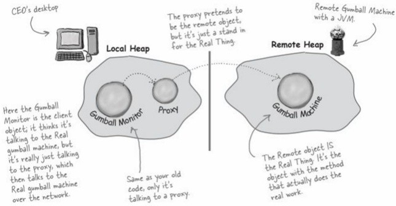
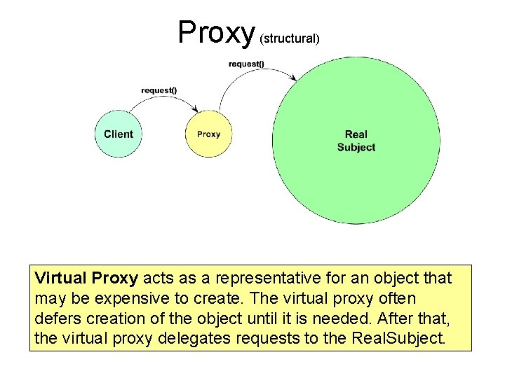

# 프록시 패턴

클라이언트가 접근하려는 객체를 대신해, 작업을 제어하는 대리객체를 이용하는 디자인 패턴

원래 하려던 기능을 수행하면서, 그 외의 부가적인 작업을 수행하고 싶을때 주로 사용되는 패턴


클라이언트에선 접근하려는 객체와 똑같이 사용되어야하기 때문에 해당 객체의 interface에 맞춰 proxy도 구현한다.

<details>
<summary>일반적인 proxy 예</summary>
<div markdown="1">

ex) 게임 실행,종료 전 log 전송

```ts
const game = new Game();

sendLog(); // 사용되어야하는 곳 마다 추가
game.start();

sendLog();
game.end();
```

```ts
// Subject
interface Game {
  start(): void;
  end(): void;
}

// RealSubject
class GameImpl implements Game {
  start() {
    console.log("게임을 시작합니다.");
  }

  end() {
    console.log("게임을 종료합니다.");
  }
}

// Proxy
class GameProxy implements Game {
  #game = new GameImpl();

  start() {
    this.sendLog();
    this.#game.start();
  }

  end() {
    this.sendLog();
    this.#game.end();
  }

  sendLog() {
    console.log("유저 정보 send");
  }
}
```

```ts
const gameProxy = new GameProxy();

gameProxy.start(); // sendLog도 함께 동작
gameProxy.end(); // sendLog도 함께 동작
```

</div>
</details>

---

## 프록시 종류

프록시 패턴은 다양한 형태로 쓰인다. 진짜 객체를 대리하는건 동일한데, 그 proxy가 어떤 일을 하냐에 따라 종류가 나뉜다.

### 1. 원격프록시

```
다른 주소공간의 객체를 접근할 때 이용하는 proxy
```

사용자는 proxy에 메시지를 보내고, proxy가 이 메시지를 네트워크 너머에 있는 실제 객체로 전달하게 된다. 그리고 실제 객체의 return을 사용자 proxy로 전달하고, 사용자는 그 proxy에게 return을 전달받는다.



- 책에서는 다른 jvm 공간이라 표현했는데, 네트워크 너머 연결을 기준으로 클라이언트/서버 라고 표현하는거도 괜찮치 않을까?
  - 원격프록시의 목적은 클라이언트에서 네트워크 너머의 객체에 접근할 때, 같은 클라이언트에 있는거 처럼 사용하기 위해 존재하는 proxy
- 네트워크 요청레벨과 가장 가까운 곳에 존재하는 Proxy
- 같은 머신 / 다른 프로세스에 따라 또 나뉘어질 수 있다고 함 ref) https://johngrib.github.io/wiki/pattern/proxy/
  - `다른 jvm 공간`이라 표현보단 `다른 주소공간`이란 표현이 좀 더 와닿긴했다.

### 2. 가상 프록시

```
생성하는 데 많은 비용이 드는 객체를 대신하는 proxy
```

진짜 객체 생성 전이나, 객체 생성 도중에 클라이언트가 접근하면, proxy가 대신하고 객체생성이 끝나면 진짜 객체에게 요청을 전달한다.


- 특징이라면, proxy에서 처음부터 진짜 객체를 초기화하지 않는다. 호출 되었을 때 찐객체를 생성함
  - 아무래도 초기화하는데 부담스러우니, Proxy 생성자에서 찐객체 멤버를 초기화 안한다.
  - 프록시를 통해 찐객체의 메서드를 불렀을 때, 비로서 proxy에서 초기화시작한다.

### 3. 보호 프록시

```
객체에 대한 접근 권한을 제어하거나 객체마다 접근 권한을 달리하고 싶을때 사용하는 proxy
```


\*Proxy API를 사용해서 다이어그램과는 조금 상이한 interface 입니다.

<details>
<summary>보호 proxy 예</summary>
<div markdown="2">

ex) 소개팅앱 외모 점수자기 자신에게 줄 수 없게 제한하기 (p.506)

```ts
// Person
export interface Person {
  name: string;
  score: number;

  setScore(score: number): void;
}

export class PersonImpl implements Person {
  name: string;
  score: number;

  constructor(name: string) {
    this.name = name;
    this.score = 0;
  }

  setScore(score: number): void {
    this.score = score;
  }
}
```

```ts
// Handlers
import { Person } from "../Subject";

// 자기 자신 proxy
// ProxyHandler가 InvocationHandler에 해당
export class OwnerProxyHandler implements ProxyHandler<Person> {
  set(target: Person, key: string, val: unknown) {
    if (key === "score") {
      throw Error("자기 자신에게 점수를 줄 수 없습니다.");
    }

    return Reflect.set(target, key, val);
  }
}

// 타인 proxy
export class NonOwnerProxyHandler implements ProxyHandler<Person> {
  set(target: Person, key: string, val: unknown) {
    return Reflect.set(target, key, val);
  }
}
```

```ts
import { Person, PersonImpl } from "./Subject";
import { NonOwnerProxyHandler, OwnerProxyHandler } from "./Handlers";

const chulSoo = new PersonImpl("철수");

const ownProxy = new Proxy<Person>(chulSoo, new OwnerProxyHandler());
const nonOwnProxy = new Proxy<Person>(chulSoo, new NonOwnerProxyHandler());

nonOwnProxy.setScore(123213);
ownProxy.setScore(123213); // error
```

</div>
</details>

### 4. 그 외 프록시

- 방화벽 프록시
- 스마트 레퍼런스 프록시
- 캐싱 프록시
- 동기화 프록시
- 복잡도 숨김 프록시
- 지연 복사 프록시

### 결론

- 원래 하려던 기능을 수행하면서, 그 외의 부가적인 작업을 수행하고 싶을때 주로 사용되는 패턴
- Proxy 종류도 개발자가 정의하기 나름이라 생각했는데, 어느정도 proxy 종류가 나뉘어져 있는게 신기하다.
- 가상프록시에선 이미지를 load 비동기 처리할 때, `별도의 스레드를 생성`하고 `volatile`, `synchronized` 쓰고 하는데, 이걸 보니까 js가 비동기 다루는게 비교적 쉬운편 같다. (지금은 자바도 편하게 할 수 있는가?)

## ETC

- [자바스크립트 Proxy](https://ko.javascript.info/proxy)
- AOP: 여러 객체에 공통으로 적용할 수 있는 기능을 분리해서 재사용성을 높여주는 프로그래밍 기법
